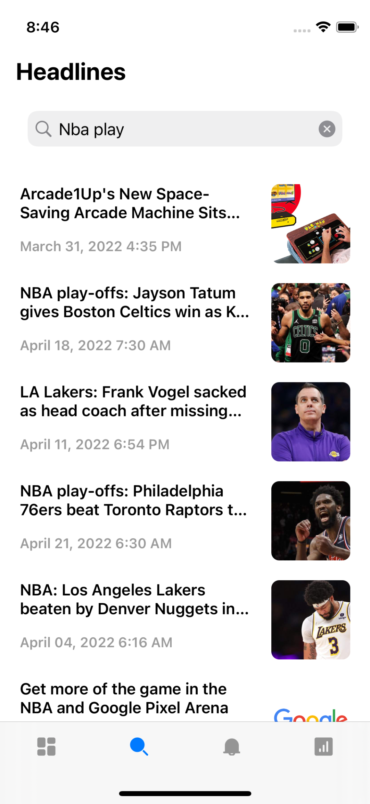
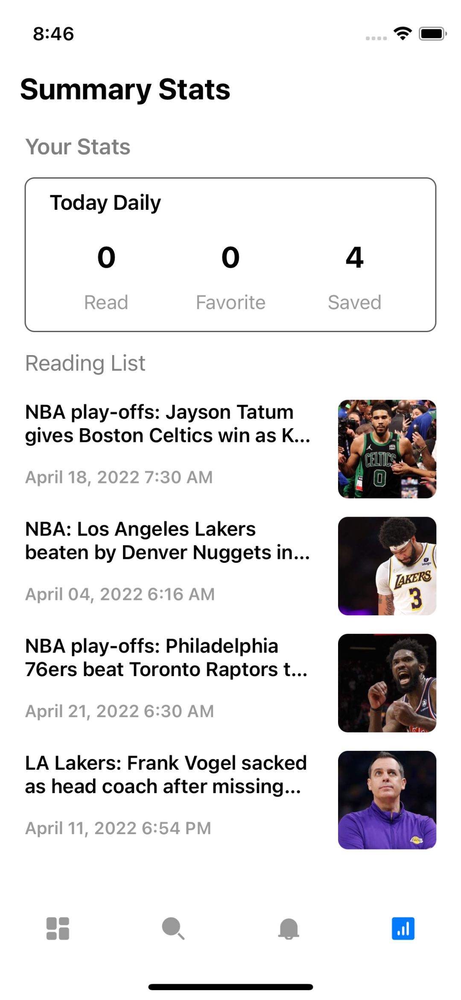

# PixelNews iOS App #
PixelNews App was built to make it easier to see news portals, articles from various media. This app also provides a covid19 tracker feature.

### Screenshots ###
   

### Tech ###
* [Swift](https://developer.apple.com/swift/)
* [UIKit](https://developer.apple.com/documentation/uikit)
* [CoreData](https://developer.apple.com/documentation/coredata)
* [Alamofire](https://github.com/Alamofire/Alamofire)
* [Kingfisher](https://github.com/onevcat/Kingfisher)

### API ###
* [News](https://newsapi.org)
* [Covid19](https://data.covid19.go.id/public/api/update.json)
